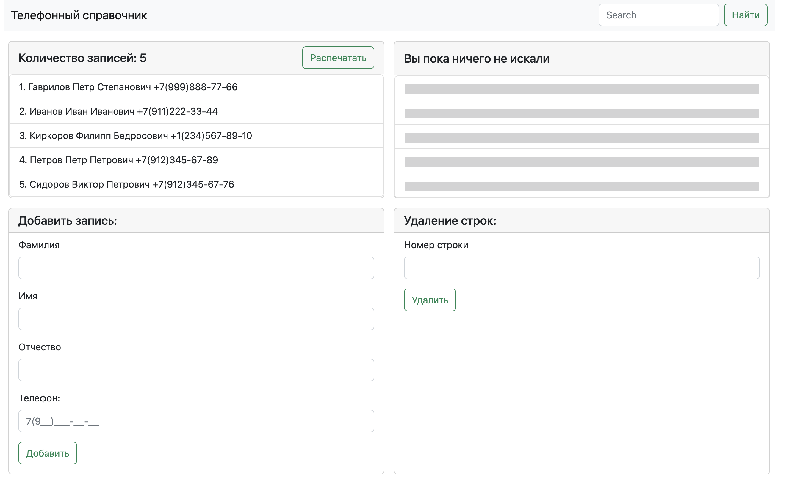

# Телефонный справочник

## Для разработки был использован фреймворк Flask с базой данных SQLite

Демо можно посмотреть [здесь](https://1greenfest.pythonanywhere.com/).

## Были реализованы следующие функции:

- Отображение всего списка записей
- Добавление новой записи в базу данных
- Поиск по базе данных
- Удаление строки базы данных
- Печать всего справочника
